> [!NOTE]
> This project is no longer being maintained as music (from Spotify, Soundcloud, YouTube, etc.) on Discord is a continuous race of breaking TOS and with recent updates to YouTube bypassing security is not possible and shouldn't be attempted either.

## Introduction

Remix is a music app designed for personal or private Discord servers. It should not be used in production or starting a business that would literally go nowhere.

It was made to provide features that other bots in production cut off or lock behind premium or more expensive monthly subscriptions.

Most of them usually use [lavalink](https://github.com/lavalink-devs/Lavalink) behind the scene that doesn't support many sites, filters, longer playback pause, and also require your attention for maintenance.

With [DisTube](https://github.com/skick1234/DisTube), you can play from a plenty of sites ([almost 1k!](https://github.com/yt-dlp/yt-dlp/blob/master/supportedsites.md)) with custom [ffmpeg audio filters](https://ffmpeg.org/ffmpeg-filters.html#Audio-Filters) (upto 100) of your own!

### Minimum Requirements

- [Node](https://nodejs.org/en/download) v18 or higher
- Strong internet connection
  - 20 - 40 ms
  - at most 100ms
- At least 256MB of RAM
- 20% CPU load/tolerance [if you're on a cheap host (generally [docker](https://www.docker.com/)ized)]

## Installation

Clone this repository

```sh
git clone https://github.com/execaman/Remix
```

Open that directory in a code editor, or just `cd` into it

```sh
cd Remix
```

Install dependencies

```sh
npm install
```

Start the bot

```sh
npm start
```

### Errors?

If you get errors related to [`node-gyp`](https://github.com/nodejs/node-gyp) (`@discordjs/opus` or `zlib-sync`), your node installation is partial (in terms of features). Go ahead and follow the guide [here](https://github.com/nodejs/node-gyp) to fix it and reinstall nodejs.

### Configuration

Most of the settings can be configured from [`src/utility/config.mts`](./src/utility/config.mts)

- `db` [MongoDB](https://www.mongodb.com/basics/mongodb-connection-string#how-to-get-your-mongodb-atlas-connection-string) \*
- `token` [Discord Bot Token](https://discordjs.guide/preparations/setting-up-a-bot-application.html#creating-your-bot) \*
- [`./cookie.json`](./cookie.json) [YouTube Cookie](https://distube.js.org/#/docs/DisTube/main/general/cookie) \*
- `spotifyOptions` [Spotify API](https://developer.spotify.com/documentation/web-api/concepts/apps)
- `soundCloudOptions` [SoundCloud API](https://soundcloud.com/you/apps) (Discontinued)

Options marked with asterisk (\*) are required to be configured

- You must enable [`MessageContent`](https://discord.com/developers/docs/topics/gateway#message-content-intent) intent from the discord [application](https://discord.com/developers/applications) page and add the intent in [`src/client.mts`](./src/client.mts) to enable text commands

- You can configure other options like [`emoji`](./src/utility/config.mts) and [`filters`](./src/utility/filters.mts)

## Interaction

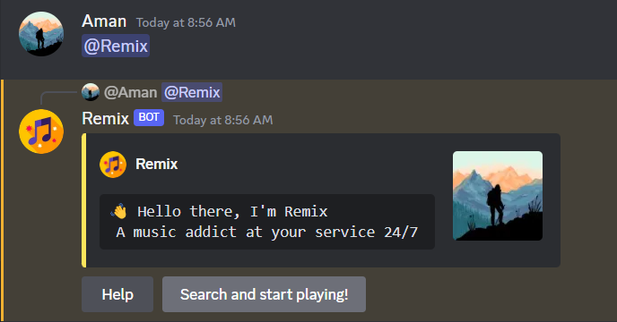

### Why prefer mentions?

This way of interacting has never faced any problems over the years + requires no [privileged intents](https://discord.com/developers/docs/topics/gateway#privileged-intents) at all!

Also because there are a few problems with using commands

### Text commands:

You have to make sure prefixes for all bots are unique:

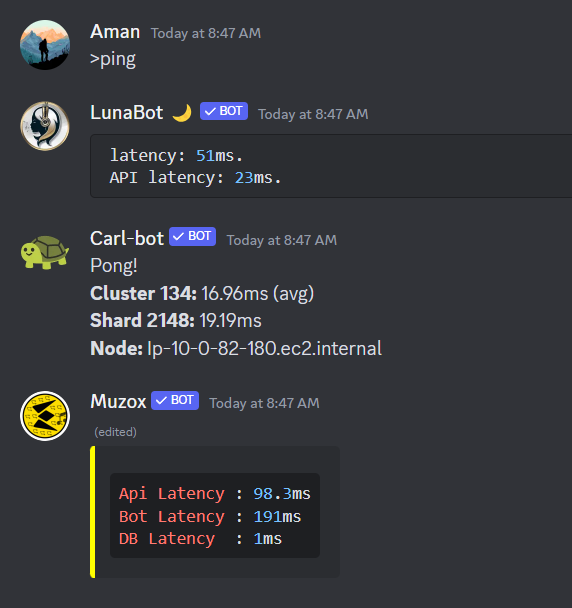

### Slash commands:

Commands don't appear on specific servers:

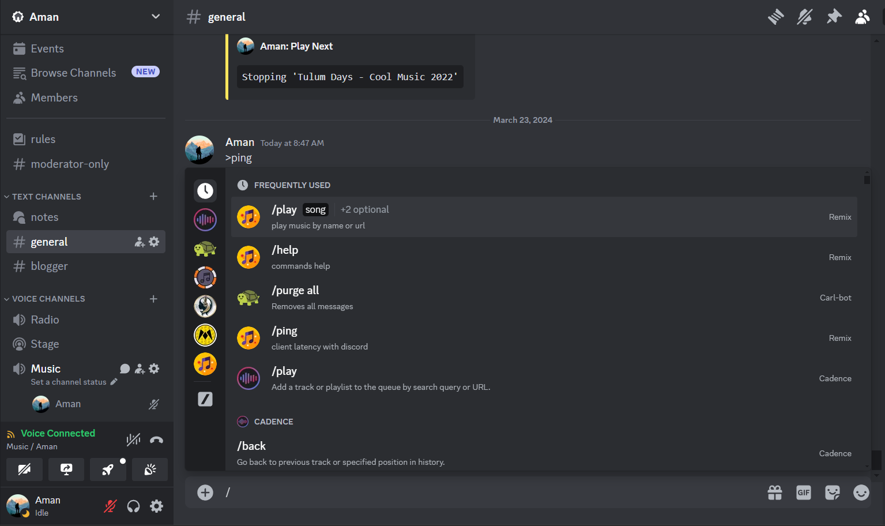
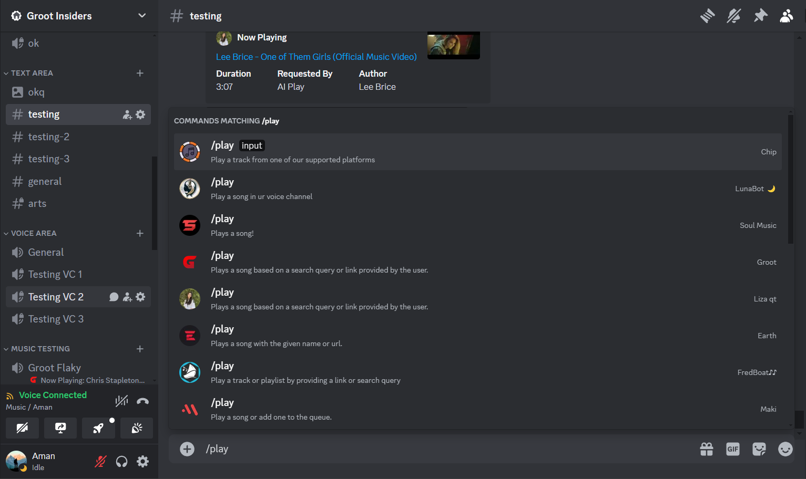

## Showcase

Don't worry, you'll get used to the interface over time if you really treat it like an app instead of a bot, here are a few interesting sections worth exploring:

## Player

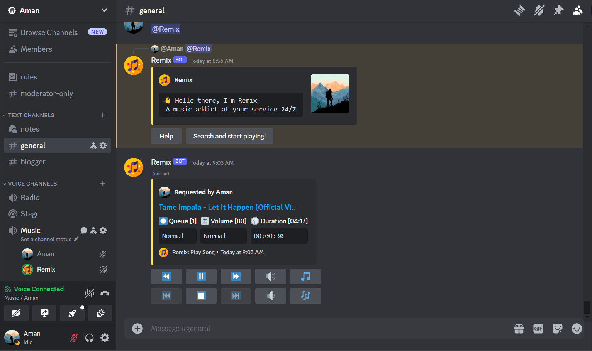

## Track Options

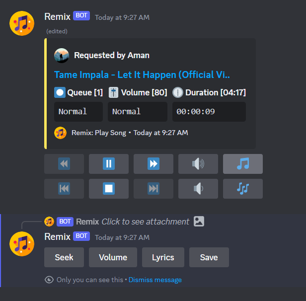

## Lyrics

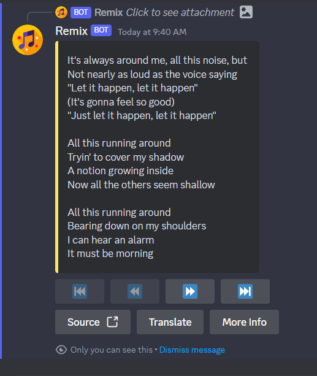
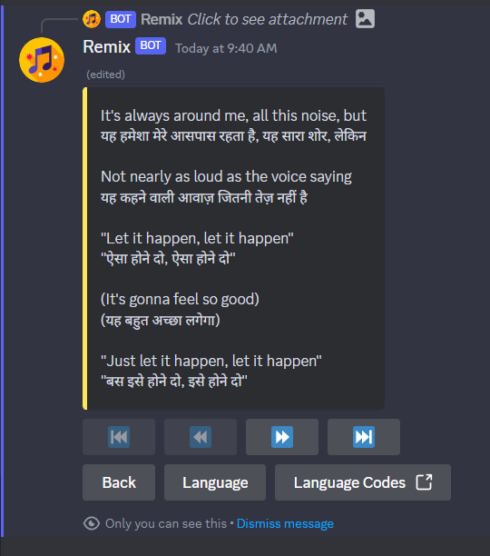
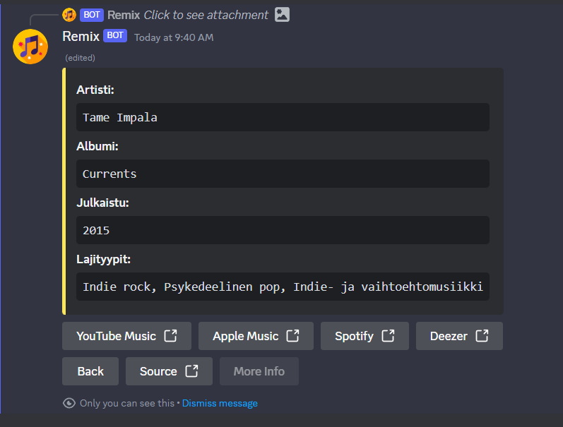

## Saves (Playlist?)

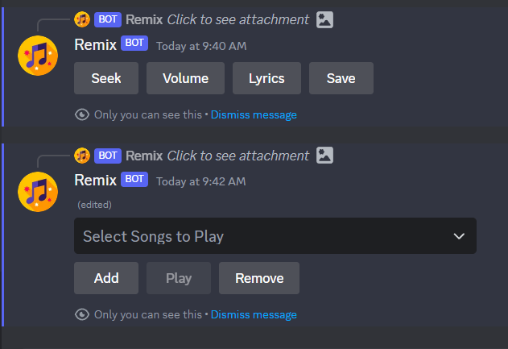

## Queue Options

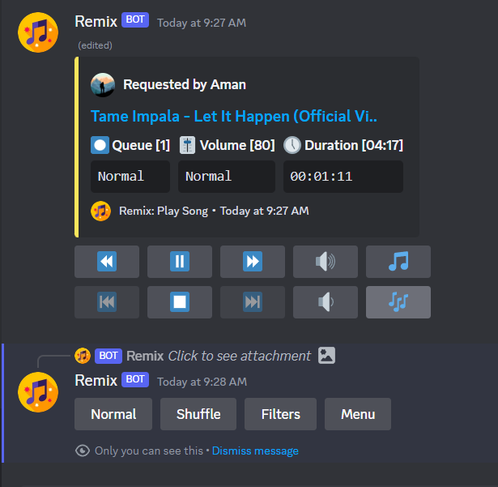

## Filters

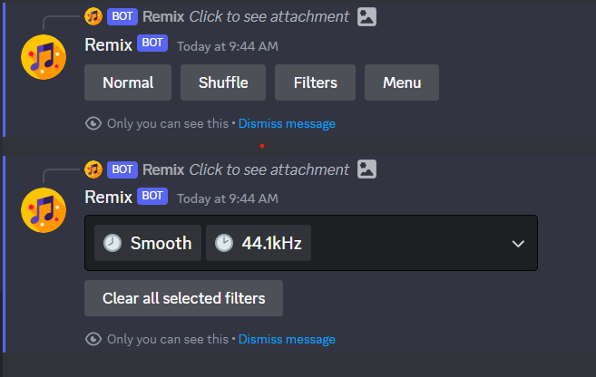

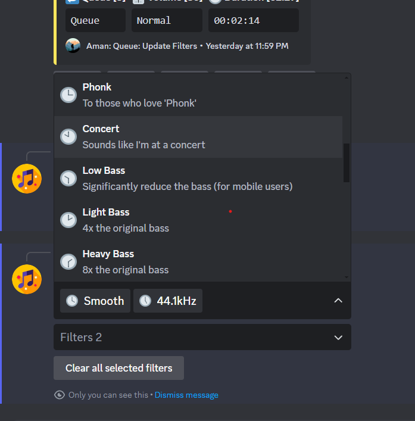

## Queue Management

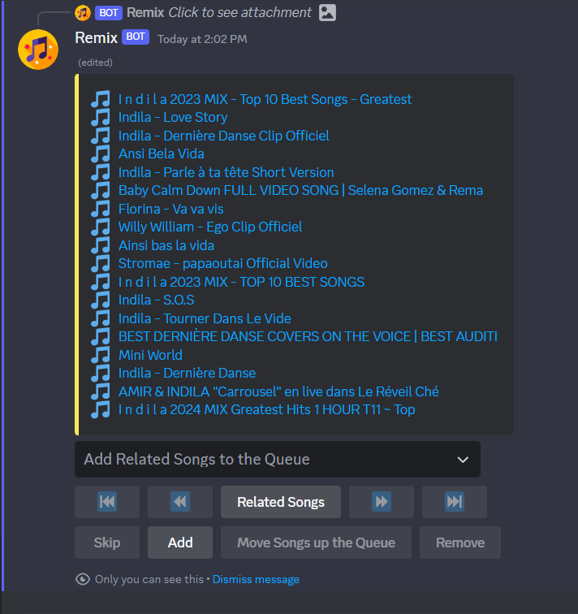
